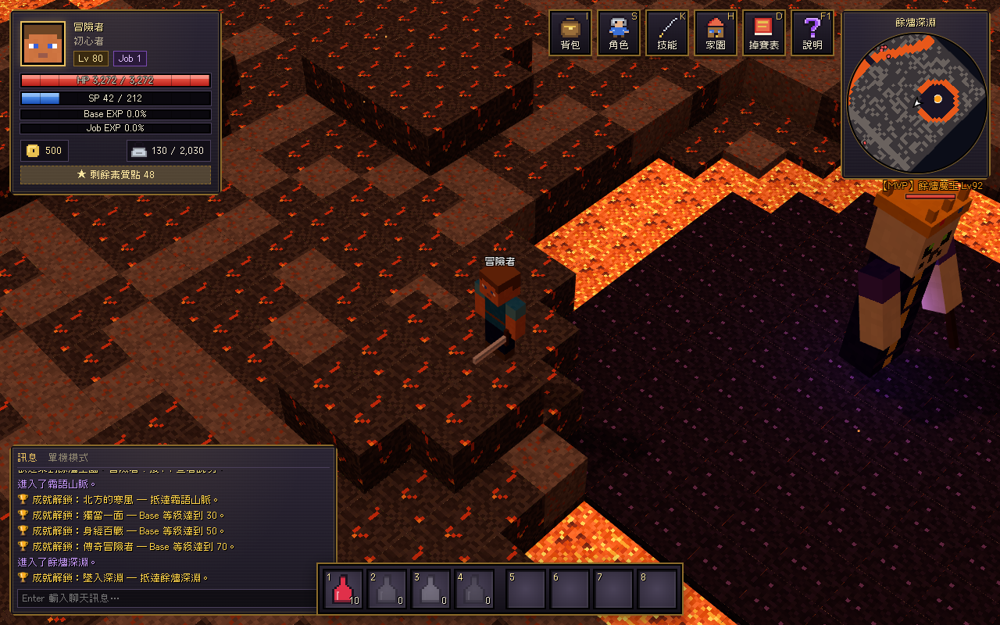

# 餘燼王國 Realm of Embers

**Minecraft 風格的 2.5D 經營 RPG**：像天堂 / RO 仙境傳說一樣打怪掉寶、升級轉職、強化衝裝、插卡，
再回到自己的家園採礦伐木、打造裝備，拿到交易所和其他玩家交易。目標是上架 Steam。




## 快速開始

```bash
npm install
npm run dev        # 開發伺服器 http://localhost:5173
npm test           # 單元測試（掉率驗證、交易防複製…）
npm run sim:drops  # 掉寶平衡報表
npm run sim:leveling # 練功節奏報表（每級耗時、最佳練功怪）
npm run art:export # 匯出目前材質與模型清單給美術當範本（art/templates/）
npm run server     # 連線伺服器 ws://localhost:8787（標題畫面選「連線遊玩」）
npm run host       # 自己電腦開測試服（網頁 + 連線同一個埠），搭配 Cloudflare Tunnel 給朋友玩
npm run desktop    # 以 Electron 桌面版執行（有開 Steam 時會自動連上 Steam）
npm run dist:win   # 打包 Windows 版到 release/win-unpacked（Linux：dist:linux、Mac：dist:mac）
npm run build      # 產生 dist/
npm run build:server # 產生正式版伺服器 dist-server/
```

正式架設伺服器（PostgreSQL + HTTPS + Steam 登入）：見 [部署手冊](docs/deploy.md)，`cd deploy && docker compose up -d --build`。

## 操作

| 按鍵 | 功能 |
|---|---|
| 左鍵 | 移動 / 攻擊 / 撿取 / 採集 / 對話 |
| 右鍵拖曳、Q / E | 旋轉視角 |
| 滾輪 | 縮放 |
| 空白鍵 | 攻擊最近的怪物 |
| Z | 撿取附近物品 |
| 1 ~ 4 | 快捷物品（在背包選消耗品按「快捷 1~4」指定，右鍵快捷格清除） |
| 5 ~ 8 | 快捷技能 |
| I / S / K / H / D / F1 | 背包 / 角色 / 技能 / 家園 / 掉寶表 / 說明 |
| L | 任務日誌 |
| O | 設定（音量、陰影、解析度、天氣粒子） |
| Enter / F11 | 聊天 / 全螢幕 |

## 已完成的系統

- **方塊世界**：16×16 像素材質的地形、樹木、房屋、傳送門、雲，方塊人物與怪物（行走動畫、受擊閃紅、陰影）；地形角落環境光遮蔽、水面起伏與像素波光、草隨風擺動
- **美術替換管線**：`art/blocks/*.png` 換方塊材質、`art/models/*.glb`（Blockbench 匯出，含 idle/walk/attack 動畫）換角色與怪物，不用改程式 → [美術指南](art/README.md)
- **戰鬥與成長**：RO 式 Base/Job 等級、六素質、一轉 4 職 + 二轉 4 職、33 個主動 / 被動技能（範圍、增益、治療）、命中/迴避/爆擊、死亡懲罰
- **練功節奏**：以真實戰鬥公式模擬每級耗時，怪物經驗由公式校準；單次擊殺上限、休息經驗 → [設計文件](docs/leveling.md)
- **多人連線**：權威伺服器（單機也跑同一份程式）、看得到其他玩家、聊天、玩家交易視窗、共用交易所、撿取優先權
- **掉寶**：獨立欄位 + 寶箱池 + 0.01% 卡片 + MVP 獎勵與保底、稀有度掉率區間驗證 → [設計文件](docs/drop-economy.md)
- **強化**：天堂式安定值、失敗蒸發、祝福卷軸、保護卷軸
- **交易**：玩家交易視窗（鎖定/確認/原子交換）、交易所（上架費、交易稅、託管）
- **家園**：採礦、伐木、熔爐、木工台、鐵砧、鍊金台、家園與設施升級
- **任務**：新手導覽員露娜的教學主線（帶玩家走過打怪、撿取、家園、伐木、製作、轉職、交易所、倉庫、新地圖）與依等級分段的每日討伐；NPC 頭上 ❕ / ❔ 標記、任務追蹤列、任務日誌（L）
- **背包 / 倉庫**：搜尋、排序、雙擊或右鍵使用 / 裝備、與身上裝備比較（▲▼）、RO 式負重分級（50% 停止回復、90% 無法戰鬥）；城鎮倉庫管理員與家園管家提供 300 格倉庫
- **技能 / 角色視窗**：每個技能顯示「目前 → 下一級」實際數值、預覽二轉技能、Shift 一次點滿；加素質前預覽能力變化、Shift 一次加 5 點
- **音效 / 音樂**：WebAudio 即時合成的戰鬥、採集、強化音效與每張地圖不同風格的晶片音樂（暫代，之後換正式配樂）
- **介面**：像素中文字體（俐方體 11 號，可商用）、金邊石板風格視窗、方塊頭像、旋轉小地圖、全服公告
- **組隊**：6 人隊伍、經驗均分（+15%/人）、隊伍掉寶優先權、隊伍頻道
- **第二張地圖**：霜語山脈（Lv 50~70），雪地、冰湖、6 種新怪物與 MVP 冰霜女王、新裝備層級
- **第三張地圖**：餘燼深淵（Lv 70~90），發光流動的岩漿河、玄武岩柱、上飄的火星，6 種新怪物與 MVP 餘燼魔王、新裝備層級
- **桌面版 / Steam**：Electron 打包（Windows / Linux / Mac）、Steam 成就 / Overlay / Rich Presence、SteamPipe 上傳設定（`steam/`）
- **成就**：19 個，由伺服器判定、同步到 Steam
- **存檔**：自動存檔（單機存在本機；連線版存在 PostgreSQL）
- **伺服器上線**：Steam 登入票證驗證、稽核日誌、每 IP 連線限制、健康檢查 / Prometheus 指標、Docker + Caddy 自動 HTTPS

## 文件

- [遊戲設計文件](docs/GDD.md)
- [經驗值與練功節奏設計](docs/leveling.md)／[練功節奏報表](docs/leveling-report.md)
- [掉寶率與經濟設計](docs/drop-economy.md)／[掉寶平衡報表](docs/drop-report.md)
- [上架 Steam 技術路線](docs/steam-roadmap.md)
- [伺服器部署手冊](docs/deploy.md)
- [美術資源替換指南](art/README.md)
