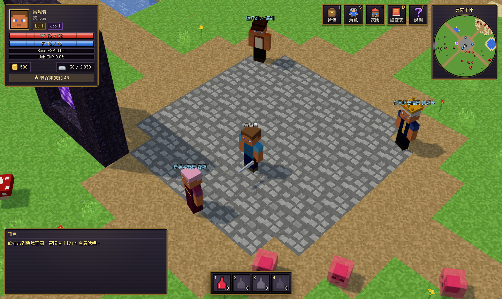
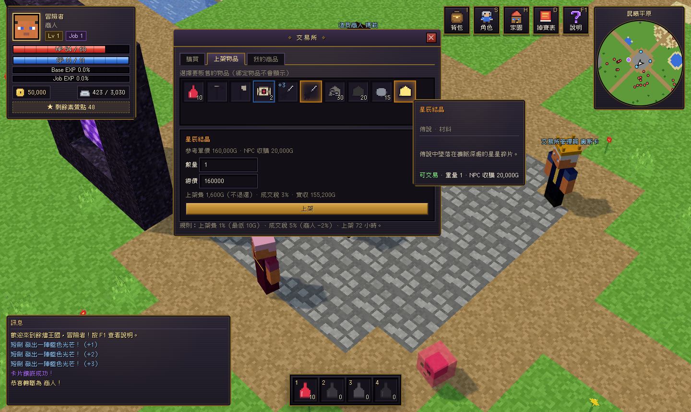

# 餘燼王國 Realm of Embers

**Minecraft 風格的 2.5D 經營 RPG**：像天堂 / RO 仙境傳說一樣打怪掉寶、升級轉職、強化衝裝、插卡，
再回到自己的家園採礦伐木、打造裝備，拿到交易所和其他玩家交易。目標是上架 Steam。




## 快速開始

```bash
npm install
npm run dev        # 開發伺服器 http://localhost:5173
npm test           # 單元測試（掉率驗證、交易防複製…）
npm run sim:drops  # 掉寶平衡報表
npm run sim:leveling # 練功節奏報表（每級耗時、最佳練功怪）
npm run server     # 連線伺服器 ws://localhost:8787（標題畫面選「連線遊玩」）
npm run build      # 產生 dist/
```

## 操作

| 按鍵 | 功能 |
|---|---|
| 左鍵 | 移動 / 攻擊 / 撿取 / 採集 / 對話 |
| 右鍵拖曳、Q / E | 旋轉視角 |
| 滾輪 | 縮放 |
| 空白鍵 | 攻擊最近的怪物 |
| Z | 撿取附近物品 |
| 1 ~ 4 | 快捷藥水 |
| I / S / H / D / F1 | 背包 / 角色 / 家園 / 掉寶表 / 說明 |

## 已完成的系統

- **方塊世界**：16×16 像素材質的地形、樹木、房屋、傳送門、雲，方塊人物與怪物（行走動畫、受擊閃紅、陰影）
- **戰鬥與成長**：RO 式 Base/Job 等級、六素質、四種轉職、命中/迴避/爆擊、死亡懲罰
- **練功節奏**：以真實戰鬥公式模擬每級耗時，怪物經驗由公式校準；單次擊殺上限、休息經驗 → [設計文件](docs/leveling.md)
- **多人連線**：權威伺服器（單機也跑同一份程式）、看得到其他玩家、聊天、玩家交易視窗、共用交易所、撿取優先權
- **掉寶**：獨立欄位 + 寶箱池 + 0.01% 卡片 + MVP 獎勵與保底、稀有度掉率區間驗證 → [設計文件](docs/drop-economy.md)
- **強化**：天堂式安定值、失敗蒸發、祝福卷軸、保護卷軸
- **交易**：玩家交易視窗（鎖定/確認/原子交換）、交易所（上架費、交易稅、託管）
- **家園**：採礦、伐木、熔爐、木工台、鐵砧、鍊金台、家園與設施升級
- **介面**：像素中文字體（俐方體 11 號，可商用）、金邊石板風格視窗、方塊頭像、旋轉小地圖、全服公告
- **存檔**：自動存檔（localStorage）

## 文件

- [遊戲設計文件](docs/GDD.md)
- [經驗值與練功節奏設計](docs/leveling.md)／[練功節奏報表](docs/leveling-report.md)
- [掉寶率與經濟設計](docs/drop-economy.md)／[掉寶平衡報表](docs/drop-report.md)
- [上架 Steam 技術路線](docs/steam-roadmap.md)
